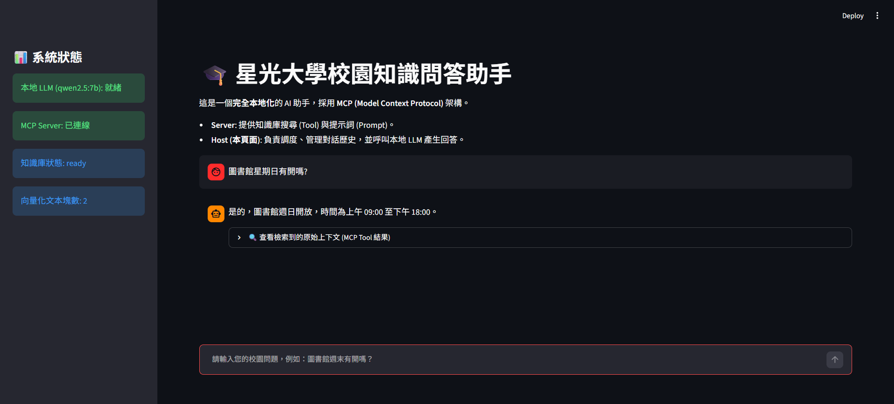
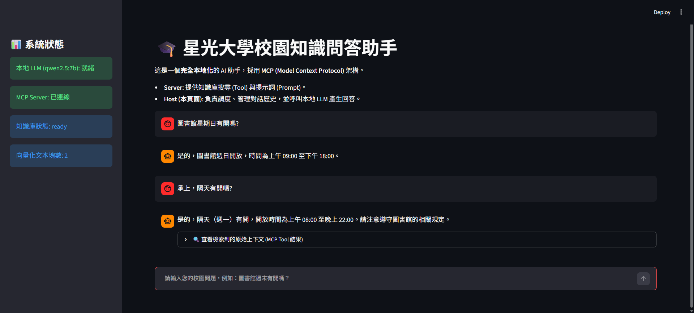

# ✨ 本地化校園知識問答助手 (MCP-RAG)

> 一個 **Agent-based MCP Client–Server 應用範例**。系統在本地運行，採用 **MCP (Model Context Protocol)** 架構 + **RAG 檢索增強生成**，結合 **Agentic Workflow**、**Human-in-the-Loop 預約確認** 與多層驗證機制。模型推理、向量檢索與預約寫入均在本機完成。

---

## 📋 專案需求對應

| 需求 | 本專案對應 |
|------|------------|
| Agent-based MCP Client–Server 應用 | `app.py` 作為 MCP Client / Host，`mcp_server.py` 作為 MCP Server |
| AI Agent 自主判斷並透過 MCP 使用 Server 工具 | `utils.py` 中的 Semantic Router、Query Rewriting、Parameter Extraction 與 MCP Tool 呼叫 |
| MCP Server 端提供 RAG 檢索功能 | `mcp_server.py` 的 `search_knowledge` Tool 與 ChromaDB 向量庫 |
| Client 端負責對話管理、Agent 運作與 Server 互動 | `app.py` 的 session state、狀態機、歷史清洗與 MCP 呼叫 |
| RAG 資料來源說明 | `knowledge_base/campus_faq.md` 為虛構校園知識庫 |
| Agent 設計方式 | 見「🤖 Agent 設計方式」 |
| 使用模型與相關技術 | 見「🛠️ 技術棧」與「⚡ 快速啟動」 |
| AI 工具輔助範圍與協作邊界 | 見「🤖 使用 AI 工具輔助開發說明」 |

---

## 🏗️ 系統架構

```
┌──────────────────────────────────────────────────────────────┐
│                  Streamlit (MCP Client / Host)               │
│                                                              │
│  Semantic Router │ Query Rewriting │ Parameter Extraction    │
│  Conversation State │ History Sanitization │ Token Budget    │
│  Local LLM via Ollama │ Structured Error Logging             │
└────────────────────────┬─────────────────────────────────────┘
                         │  stdio (MCP Protocol)
                         ▼
┌──────────────────────────────────────────────────────────────┐
│                  MCP Server (FastMCP)                        │
│                                                              │
│  📦 Resource           Tools             📝 Prompt         │
│  campus://kb-info     search_knowledge      campus_qa        │
│                       book_study_room                        │
│                       cancel_booking                         │
│                                                              │
│  Deterministic Validation:                                   │
│  room whitelist │ capacity │ purpose │ time │ blacklist       │
│  SQLite transaction lock (BEGIN IMMEDIATE)                   │
└───────┬──────────────────────────────────────┬───────────────┘
        │                                      │
        ▼                                      ▼
┌────────────────────┐              ┌────────────────────┐
│   ChromaDB (本地)   │              │   SQLite (本地)     │
│   向量知識庫        │              │   預約資料庫         │
│   nomic-embed-text  │              │   併發寫入保護       │
└────────────────────┘              └────────────────────┘
```

### Client 端職責

- 管理對話歷史與 Streamlit session state。
- 使用本地 LLM 進行意圖判斷、查詢重寫與預約參數提取。
- 透過 MCP stdio 呼叫 Server 端 Tools / Resources / Prompts。
- 呈現 Human-in-the-Loop 確認卡片與錯誤訊息。
- 對拒絕或惡意輸入進行歷史清洗，降低上下文污染風險。

### Server 端職責

- 提供 RAG 檢索 Tool：`search_knowledge`。
- 提供知識庫狀態 Resource：`campus://kb-info`。
- 提供問答 Prompt 模板：`campus_qa`。
- 提供具副作用的預約 Tools：`book_study_room`、`cancel_booking`。
- 執行確定性驗證與資料庫交易，不依賴 LLM 判斷房間容量、時間衝突等硬性規則。

---

## 🤖 Agent 設計方式

本專案的 Agent 並非單一 Prompt 問答，而是由 Client 端串接多個本地 LLM 步驟，並透過 MCP 調用 Server 端工具：

1. **Semantic Router（意圖路由）**  
   判斷使用者意圖為 `campus_info`、`booking_request`、`chitchat`、`general` 或 `refuse`，只對需要的意圖調用對應工具，減少不必要的檢索延遲。

2. **Query Rewriting（查詢重寫）**  
   處理多輪對話中的指代，例如使用者先問「圖書館星期日有開嗎？」，接著說「承上，隔天有開嗎？」時，系統會將其重寫為獨立查詢，提升向量檢索精準度。

3. **Parameter Extraction（參數提取）**  
   對預約請求提取 `room_id`、`date`、`start_time`、`end_time`、`attendee_count`、`purpose_category`、`purpose_detail`。  
   目前 Prompt 會引導 LLM 在缺少日期或時間時要求使用者補齊，並在缺少房間編號時以 `A01` 作為候補值；實際是否可預約，仍由 Server 端驗證與 Human-in-the-Loop 確認卡片把關。

4. **Tool Invocation via MCP**  
   Client 端透過 MCP 協議呼叫 Server 端工具完成 RAG 檢索、預約寫入與取消預約。

5. **Human-in-the-Loop Confirmation**  
   預約寫入前先顯示確認卡片；寫入後提供取消機制，降低 LLM 參數提取錯誤或使用者反悔造成的影響。

6. **Context Hygiene（上下文清理）**  
   - 被判定為 `refuse` 的惡意輸入不會保留在後續 LLM 歷史中。
   - 若預約曾被拒絕，參數提取會使用重置後的乾淨歷史，避免「拒絕慣性」污染下一輪合法請求。

---

## ⚡ 快速啟動

### 前置要求

- **Python**: `>= 3.12`（本專案基於 `3.12.14` 開發與測試）
- **Ollama**: 已安裝並啟動本地服務
- **依賴版本**: `requirements.txt` 已鎖定套件版本，確保環境可重現

### 安裝與啟動

```bash
# 1. 建立並啟用虛擬環境
python -m venv venv

# Windows
venv\Scripts\activate

# macOS / Linux
source venv/bin/activate

# 2. 安裝依賴
pip install -r requirements.txt

# 3. 拉取本地模型
ollama pull qwen2.5:7b
ollama pull nomic-embed-text

# 4. 複製環境變數範本

# macOS / Linux
cp .env.example .env

# Windows
copy .env.example .env

# 5. 建構知識庫
python build_knowledge_base.py

# 6. 啟動應用
streamlit run app.py
```

> 若先啟動 Streamlit 才開啟 Ollama，請啟動 Ollama 後重新整理頁面，讓連線檢查重新執行。

### 環境變數

`.env.example` 提供可替換的模型設定：

```env
GENERATIVE_MODEL=qwen2.5:7b
EMBEDDING_MODEL=nomic-embed-text
```

- 更換 `GENERATIVE_MODEL` 後，請確保 Ollama 已拉取對應模型，並建議重新測試預約與注入案例，確認 JSON 輸出穩定。
- 更換 `EMBEDDING_MODEL` 後，必須重新執行 `python build_knowledge_base.py`，因為向量空間會隨嵌入模型改變。

> 📌 **RAG 資料來源說明**：`knowledge_base/campus_faq.md` 為虛構的校園知識庫範例，涵蓋圖書館本館、討論室、校園網路、宿舍、餐廳與交通等情境。知識庫刻意建立「整體設施」與「局部設施」的層級關係，例如圖書館本館開放時間與討論室開放時間不同，以避免 RAG 將局部規定誤判為全館規定。實際部署時可替換為真實校園文件。

---

## 📸 成果預覽與驗證方式

### 免啟動觀察：多輪對話截圖

以下截圖用於讓讀者在不安裝 Ollama、不啟動 Streamlit 的情況下，快速理解系統的多輪對話與 Query Rewriting 行為。

| 第一輪提問 | 第二輪追問（上下文繼承） |
|:---:|:---:|
|  |  |
| `圖書館星期日有開嗎?` | `承上，隔天有開嗎?` |

> 截圖僅呈現其中一組多輪問答情境。第一輪問題可直接進入 RAG 檢索；第二輪問題含有「承上」與「隔天」等上下文指代，系統會先結合對話歷史重寫為獨立查詢，再進行檢索與回答。

---

## 🔑 技術亮點

### 1. 本地運行，資料不出本機

模型推理、向量檢索與預約寫入均在本機完成，無雲端 API 依賴。適合處理校園敏感資料，也方便離線演示。

### 2. 基於 MCP 協議的 Client–Server 架構

採用 Anthropic MCP 規範，將系統職責分離：

- **Tools**：知識檢索、預約寫入、取消預約
- **Resources**：知識庫狀態查詢
- **Prompts**：問答提示詞模板

Client 與 Server 透過 stdio 通訊，更換模型、新增工具或替換前端時，彼此影響較低。

### 3. RAG 檢索與知識庫層級設計

Server 端提供 `search_knowledge` Tool，基於 ChromaDB 與 `nomic-embed-text` 進行向量檢索。知識庫文件採用層級化結構，並在 Prompt 中提醒模型區分「圖書館本館」與「討論室」等局部設施，降低局部規定取代全館規定的風險。

### 4. Agentic Workflow：按需調用工具

Client 端先進行意圖路由，再決定是否調用 RAG、查詢重寫或預約參數提取。一般問候與常識問題不會無謂地觸發知識庫檢索。

### 5. Query Rewriting 處理多輪指代

當使用者先問「圖書館星期日有開嗎？」，接著說「承上，隔天有開嗎？」時，系統會結合歷史對話，將問題重寫為獨立、完整的查詢語句，例如「星光大學圖書館星期一有開嗎？」，再送入向量檢索。

### 6. Human-in-the-Loop 預約確認

具副作用的預約操作不會直接寫入資料庫：

- **執行前確認**：顯示房間、日期、時間、用途等資訊，使用者確認後才提交。
- **執行後補償**：預約成功後提供取消選項，處理誤訂或反悔情境。

### 7. 確定性業務驗證交由 Server 端執行

房間白名單、容量匹配、時間格式、開放時段、過去時間、用途分類、黑名單關鍵字與時段衝突等硬性規則，由 MCP Server 端以 Python 程式驗證，不依賴 LLM 判斷。LLM 主要負責從自然語言中提取參數。

至於日期、時間、房間編號等欄位是否必須由使用者明確提供，目前仍以 Prompt 引導與 Human-in-the-Loop 確認卡片作為主要把關機制；後續可依實際校務規則調整為更嚴格的 Server 端必填驗證。

### 8. 多層驗證與防禦設計

| 層級 | 驗證項目 |
|------|----------|
| **Client 端 (Prompt / Router)** | 意圖攔截、注入辨識、參數完整性檢查、歷史清洗 |
| **Server 端 (Tool)** | 房間白名單、容量匹配、用途分類、黑名單關鍵字、字數限制、開放時間、過去時間 |
| **資料庫層 (SQLite)** | 參數化查詢以降低 SQL 注入風險；`BEGIN IMMEDIATE` 交易鎖以降低重複預約風險 |

### 9. 標準 Chat Message 結構

採用 `SystemMessage` + `History` + `HumanMessage` 的對話結構，將系統指令、RAG 上下文與使用者提問分層，避免 Prompt 模板與歷史對話混雜。

### 10. Token 預算控管

Client 端設定 `num_ctx=4096`，並使用滑動窗口截斷策略，從最新對話往回追溯，控制輸入長度，避免超出本地模型上下文容量。

### 11. 啟動連線驗證與錯誤衛生

- 首次載入時會真實呼叫本地 LLM 驗證 Ollama 是否可用，避免只顯示「就緒」但實際未啟動。
- UI 不直接顯示完整堆疊追蹤，而是顯示友善錯誤編號；完整堆疊追蹤寫入 `app.log`。
- MCP Server 端錯誤寫入 `mcp_server.log`。

---

## 🛡️ 安全與防禦設計

本專案針對 LLM 應用常見風險做了多層防護：

| 風險 | 對策 |
|------|------|
| Prompt Injection / 角色扮演劫持 | Router 會將明顯的注入或劫持輸入分類為 `refuse`；RAG Prompt 使用 `<context>` 隔離知識庫內容與使用者輸入 |
| 歷史上下文污染 | 惡意輸入不保留在後續歷史；預約拒絕後重置參數提取歷史 |
| 缺失參數造成誤訂 | Prompt 會引導 LLM 補問或使用預設候補值，並由 Human-in-the-Loop 確認卡片讓使用者在寫入前檢查；Server 端驗證格式、房間合法性、容量與時段衝突 |
| 房間容量誤判 | `attendee_count` 由 Server 端硬編碼驗證，不交給 LLM 判斷 |
| SQL Injection | SQLite 使用參數化查詢；房間、用途、時間均有白名單或格式驗證 |
| 重複預約 / 併發寫入 | 使用 `BEGIN IMMEDIATE` 交易鎖，在寫入前檢測時段衝突 |
| 錯誤資訊洩漏 | UI 只顯示錯誤編號，完整堆疊追蹤寫入日誌檔 |

這些機制無法宣稱抵禦所有攻擊，但能顯著降低常見 LLM 應用風險，並讓系統行為更可預期。

---

## 🧪 測試與驗證

`tests/manual_test_cases.txt` 提供一組人工測試案例，涵蓋：

- 基本問候、閒聊、常識問題
- 圖書館、宿舍、校園網路、討論室等 RAG 問答
- Prompt Injection、角色扮演劫持、系統提示詞洩漏
- 正常預約、無效房間、容量不符、不當用途、過去時間
- SQL Injection 測試輸入
- 多輪記憶與歷史污染情境

建議每次修改 Prompt、知識庫或模型設定後，至少跑過一遍這些案例。若修改 `knowledge_base/campus_faq.md` 或 `EMBEDDING_MODEL`，請重新執行：

```bash
python build_knowledge_base.py
```

---

## 🛠️ 技術棧

| 層級 | 技術 |
|------|------|
| 生成模型 | Ollama · `qwen2.5:7b`（可透過 `.env` 替換） |
| 嵌入模型 | Ollama · `nomic-embed-text`（可透過 `.env` 替換） |
| 向量資料庫 | ChromaDB |
| 交易資料庫 | SQLite |
| RAG / LLM 串接 | LangChain |
| MCP 實作 | FastMCP (Python) |
| 前端 | Streamlit |
| 環境設定 | python-dotenv / `.env` |
| 日誌 | Python `logging`（`app.log`、`mcp_server.log`） |
| 傳輸 | stdio（本地程序通訊） |

---

## 📁 專案結構

```
├── app.py                    # MCP Client：UI、狀態機、意圖分發、歷史清洗
├── utils.py                  # 核心邏輯：LLM 連線、MCP 呼叫、Router、Rewriting、參數提取
├── mcp_server.py             # MCP Server：Tools / Resources / Prompts / 確定性驗證
├── build_knowledge_base.py   # 知識庫向量化腳本
├── knowledge_base/           # RAG 原始文件（虛構校園知識庫）
│   └── campus_faq.md
├── tests/                    # 人工測試案例
│   └── manual_test_cases.txt
├── data/                     # 本地生成資料（不入版控）
│   ├── chroma_db/            # ChromaDB 向量資料庫
│   └── campus.db             # SQLite 預約資料庫
├── .env.example              # 環境變數範本
├── .gitignore
├── requirements.txt          # 已鎖定版本的依賴清單
├── README.md
└── LICENSE
```

本地運行後可能生成 `app.log` 與 `mcp_server.log`，這些日誌檔不建議納入版控。

---

## 🔮 後續擴展

- Hybrid Search（BM25 + 向量）提升檢索精準度
- Summary Memory（摘要記憶）延伸對話歷史容量
- 建立自動化回歸測試，將 `manual_test_cases.txt` 轉為可重跑的測試腳本
- 遷移至 FastAPI 實現 MCP Client 長連線與連線池
- Docker 容器化部署
- 串接真實校務系統 API

---

## 🤖 使用 AI 工具輔助開發說明

本專案開發過程中有使用 AI 工具輔助，以下說明輔助範圍與人機協作邊界：

### 人負責的部分

- **方向引導**：定義專案目標、系統架構、核心功能範圍與技術選型方向
- **技術理解與評估**：理解 MCP、RAG、Agent 等核心概念，評估不同實作方案的優劣
- **決策與取捨**：決定是否採用某項技術、是否加入特定功能（如 Human-in-the-Loop、Query Rewriting 等）
- **技術檢核**：審核程式碼正確性、架構合理性、安全性與實際運行結果

### AI 負責的部分

- **細節擴充**：根據既有方向，補充實作細節、邊界條件與例外處理
- **技術說明**：協助釐清文件、API 用法、函式庫行為等細節
- **程式碼細節**：產生、重構或優化具體程式碼片段
- **腦力激盪**：提出可能的設計方案、潛在問題與改進建議，供人評估後決定是否採用

### 協作原則

AI 僅作為加速實作與探索的輔助工具，最終架構決策、功能取捨與程式碼品質把關皆由人完成。所有核心邏輯與設計均經過人理解與驗證後才納入專案。

---

## License

Copyright © 2026 hanwu910514.

詳情請參閱[Apache License 2.0](LICENSE)檔案
